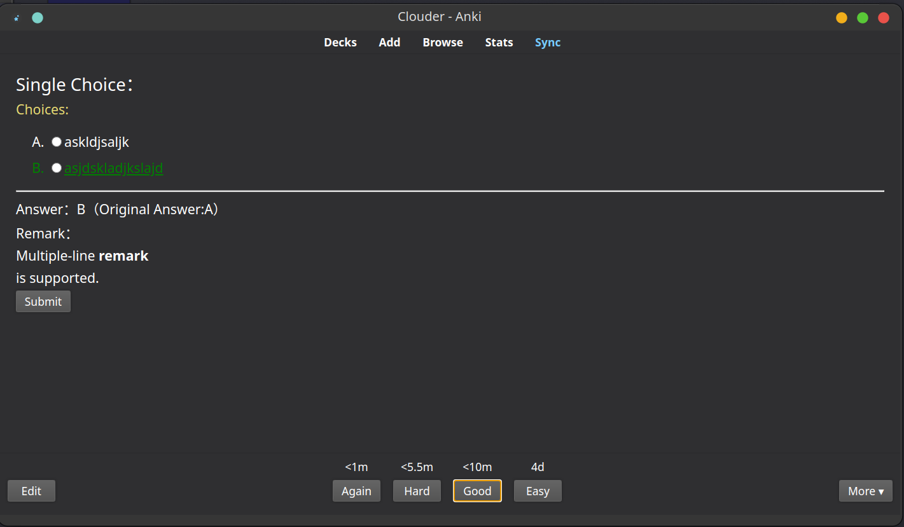

[![Release][release-shield]][release-url]
[![MIT License][license-shield]][license-url]
[![Issues][issues-shield]][issues-url]
[![Stargazers][stars-shield]][stars-url]
[![Forks][forks-shield]][forks-url]
[![Contributors][contributors-shield]][contributors-url]

# AnkiImporter
## Introduction

AnkiImporter enables you to import Anki notes directly from your plain text files. It is simple, easy to use yet not that powerful. 

There are tons of Anki Importers in the world, while this one features minimalism.

Features:

- Directly Import into Anki
- Human-Friendly Syntax
- Markdown Rendering Support
- Html Support
- Cross-Platform
- Binary Build available
- Many Useful built-in Note Types:
    - Q&A
    - Cloze
    - Choices
    - ListCloze
    - TableCloze
- Easy to Extend

---

To use this tool, you are not required to sacrifice your note readability for compatibility with Anki.

Here is a quick example:

```markdown
This is a question.
This is an answer.

Single line question.
Multiple line answer.
The first line of this block is recognized as the question.

Multiple line question is <br> possible somehow.
too hacky maybe.

markdown rendering is supported.
- use a list!
    - or something like that.

Clozes are **easy** to **create** too.
```

## Installation

### install Anki Connect

The first step is to install [AnkiConnect](https://github.com/FooSoft/anki-connect) extension.   
Code:`2055492159`  
For detailed installation guide, please visit the [anki-connect repo](https://github.com/FooSoft/anki-connect).

### install Python

Install the latest version of Python.  

This step is optional if you tend to use a binary release of the script.

### download Script

Method 1: directly download the `src` folder.

Method 2: download binary release [here](https://github.com/Clouder0/AnkiImporter/releases), which doesn't require a python environment and is ready-to-use.

### import ExampleDeck

This step is necessary because several Note Types are included in the deck.

It will create an `Export` Deck in your Anki profile, plus a tag `#Export`.   
By default, all cards imported by this tool would go into `Export` Deck with the tag `Export`, you can later modify them manually.  

This would be configurable later. #TODO#

[Download](https://github.com/Clouder0/AnkiImporter/blob/main/tests/ExampleDeck.apkg) and import it into your Anki.

This is what the Deck is like:  


Now, the installation is done.

## Usage

This is a command-line tool.

On windows, open `cmd` and execute with:  
`{yourpath}\AnkiImporter.exe {yourfile}`  
Alternatively, if you use the raw script, execute with:
`python {yourpath}\src\main.py {yourfile}`  

The process is similar on other platforms.

## Note Structure

The note to import must follow some specific structure so that it can be recognized by the script.

A block is recognized as a note. To clarify what a block is, see the example:

It is notable that Html syntax is supported in notes.

```markdown
This is a block.

This is a multiple-line  
block.

This is also a **block**.
```

Blocks are separated by two line breaks.

### Note Type

#### Q&A

The most basic type in Anki.  
Any block more than two lines, if not recognized as the other types, would be recognized as Q&A.

```markdown
Question.
Answer.
```

#### Cloze

Another basic type in Anki.  
Any block containing `**sth.**` in its first line would be recognized as a Cloze.

```markdown
This is a **Cloze**.

This is another **Cloze**  
with more than one **line**.

This is not a Cloze.
But rather a **Q&A**.
```

#### Choices

Choose A or choose B...that's a question.  




This is an extended note type that is not included in plain Anki.  
I imported a modified version of [Monokaicloze](https://github.com/ecator/anki-theme-monokaicloze-radios) to implement this feature.

Any block starting with `A` in its second line would be recognized as a Choices.

```markdown
Question:
A Option1
B Option2
C Option3
A
Remark writing, something here, can be omitted.

Question:
A Option1
B Option2
C Option3
AB

I just want a simple Q&A.
 A simple Q&A. Use space to avoid being recognized as Choices.
```

#### ListCloze

A list would be recognized as a cloze.

```markdown

- List Cloze
  - Cloze **as** a list
  - no need to contain a cloze in the first line
      - pretty **handy**
      - but remember this may make a card huge!

Example List QA
- A list, or an outlined format, are now supported.
  - SHJKD
  - lksfdhos
  - sdhfksaj
      - dskf
	  - sdkf
	      - dfjs
	      - dfjs
	  - oipw3
  - dppp
```

#### TableCloze

A table would be recognized as a cloze.

```markdown
Table is now supported too.
| Syntax      | Description | Test Text     |
| :---        |    :----:   |          ---: |
| Header      | Title       | Here's this   |
| Paragraph   | Text        | And more      |
A funny feature.

| Table      | Cloze | is also supported |
| :---        |    :----:   |          ---: |
| H**e**ader      | Title       | Here's this   |
| Parag**ra**ph   | Text        | And more      |
```

---

For more examples, see [tests](https://github.com/Clouder0/AnkiImporter/tree/main/tests).

## Credit

- [anki](https://github.com/ankitects/anki)
- [anki-connect](https://github.com/FooSoft/anki-connect)
- [genanki](https://github.com/kerrickstaley/genanki)
- [markdown2](https://github.com/trentm/python-markdown2)

## License

The source code is licensed under GPL v3.   
License is available [here](https://github.com/Clouder0/AnkiImporter/blob/main/LICENSE).

[contributors-shield]: https://img.shields.io/github/contributors/Clouder0/AnkiImporter.svg?style=for-the-badge
[contributors-url]: https://github.com/Clouder0/AnkiImporter/graphs/contributors
[forks-shield]: https://img.shields.io/github/forks/Clouder0/AnkiImporter.svg?style=for-the-badge
[forks-url]: https://github.com/Clouder0/AnkiImporter/network/members
[stars-shield]: https://img.shields.io/github/stars/Clouder0/AnkiImporter.svg?style=for-the-badge
[stars-url]: https://github.com/Clouder0/AnkiImporter/stargazers
[issues-shield]: https://img.shields.io/github/issues/Clouder0/AnkiImporter.svg?style=for-the-badge
[issues-url]: https://github.com/Clouder0/AnkiImporter/issues
[license-shield]: https://img.shields.io/github/license/Clouder0/AnkiImporter.svg?style=for-the-badge
[license-url]: https://github.com/Clouder0/AnkiImporter/blob/main/LICENSE.txt
[release-shield]: https://img.shields.io/github/release/Clouder0/AnkiImporter.svg?style=for-the-badge
[release-url]: https://github.com/siyuan-note/siyuan/releases